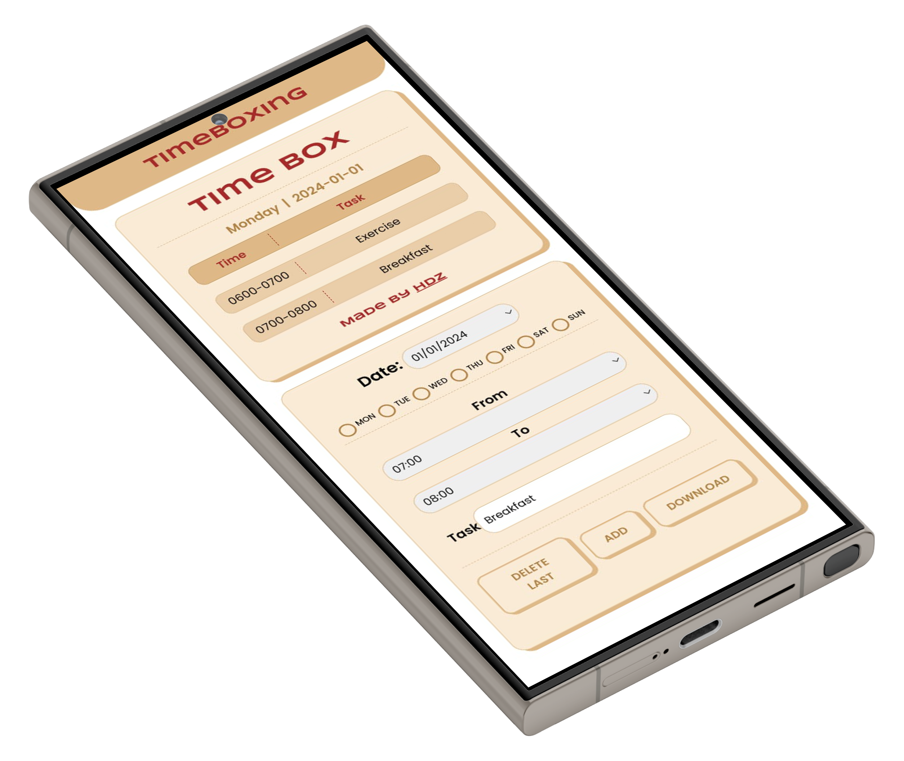
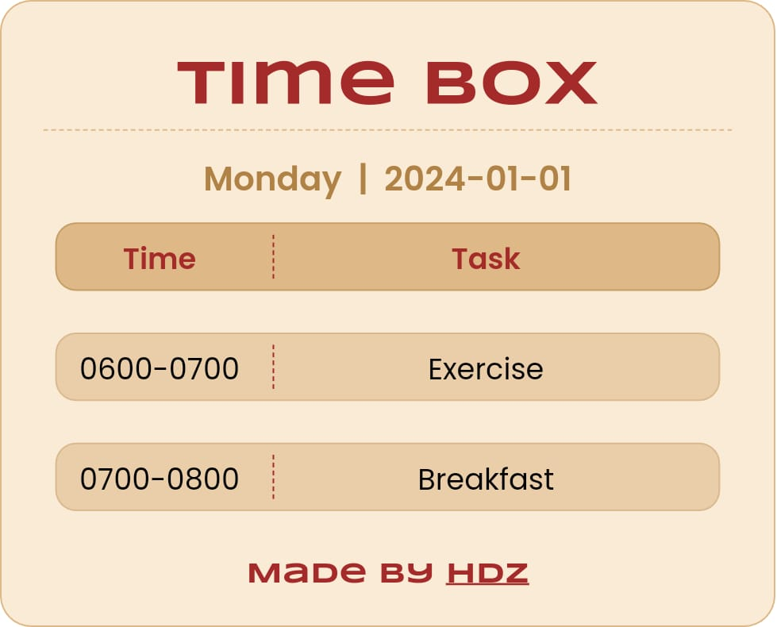

<p align="center">
   
</p>

A simple web-based tool that allows users to create, edit, and export time blocks. This project is built using HTML, CSS, JavaScript, and `html2canvas`. Users can input tasks with specific dates, days, and times, and visualize their schedule in a clean and organized manner. The tool also allows users to delete the last added task and export the created time block as an image.

## Features

- **Add Tasks**: Input the date, day, start time, end time, and task description to create a time block.
- **Delete Last Task**: Remove the last added time block.
- **Export to Image**: Export the time block canvas as an image file.
- **Responsive Design**: The layout adjusts for different screen sizes, providing a great user experience on both desktop and mobile devices.

## Demo
<p align="center">

</p>

### Output
<p align="center">

</p>

## How to Use

1. **Add a Task**:

   - Enter the date in the format `dd/mm/yyyy`.
   - Select the day of the week.
   - Set the start time (`From`) and end time (`To`) in `HHMM` format.
   - Enter the task description.
   - Click on the **"Add Task"** button to create a new time block.

2. **Delete Last Task**:

   - Click on the **"Delete Last Task"** button to remove the last added time block from the display.

3. **Export Time Block**:
   - Once you are satisfied with your time blocks, click on the **"Export to Image"** button to save the time block canvas as an image file.

## Installation

To run this project locally, follow these steps:

1. **Clone the Repository**:

```bash
git clone https://github.com/hdz-088/TimeBoxing.git
```

2. Navigate to the Project Directory:

```bash
cd TimeBoxing
```

3. Open the index.html file in your browser:

```bash
open index.html
```

## Dependencies

- **html2canvas**: Used to export the time blocks as an image. Ensure this library is included in your project.

## Contributing

Contributions are welcome! Please feel free to submit a Pull Request.

1. Fork the repository.
2. Create a new branch (git checkout -b feature-branch).
3. Make your changes.
4. Commit your changes (git commit -m 'Add some feature').
5. Push to the branch (git push origin feature-branch).
6. Open a Pull Request.

## Attributes

- **html2canvas**: This project uses <a href="https://github.com/niklasvh/html2canvas">html2canvas</a> to capture the DOM and export it as an image.

- **Fonts**: <a href="https://fonts.google.com/">Google Fonts</a> for typography.

- **Favicon**: <a href="https://www.flaticon.com/free-icons/checklist" title="checklist icons">Checklist icons created by Graphics Plazza - Flaticon</a>

- **Mockup**: <a href="https://mockuphone.com/model/galaxy-s24-ultra/">Samsung Galaxy S24 Ultra</a>

## License

This project is licensed under the MIT License - see the [LICENSE](LICENSE) file for details.

## Contact

For any inquiries, feel free to reach out:

Email: <a href="mailto:hdz088@outlook.com">hdz088@outlook.com</a>
<br>
Resume: <a href="https://drive.google.com/file/d/1LLHtmId7wi6zRWCz5_BH5VkniBkrx0X7/">Resume</a>
